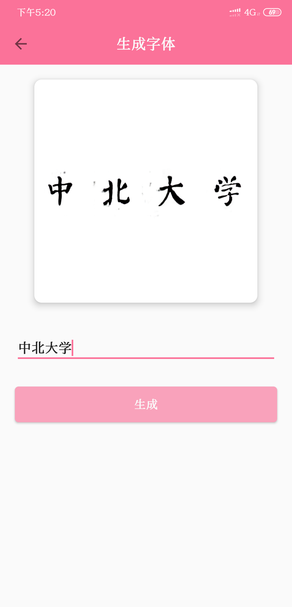
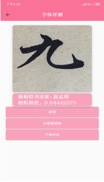
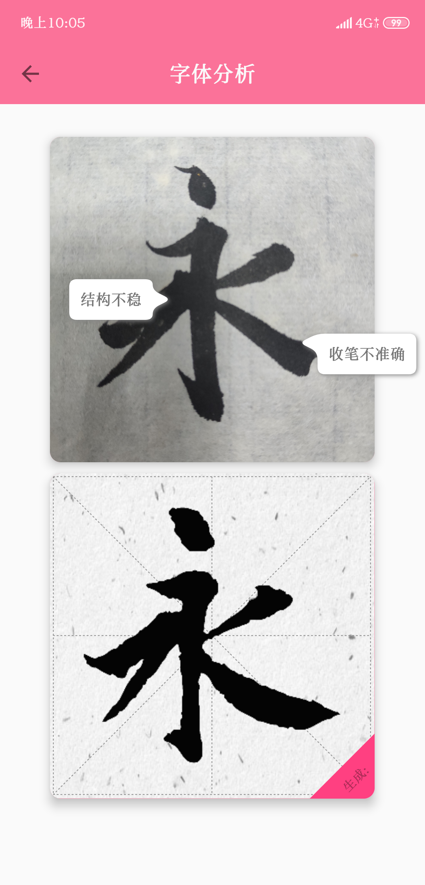
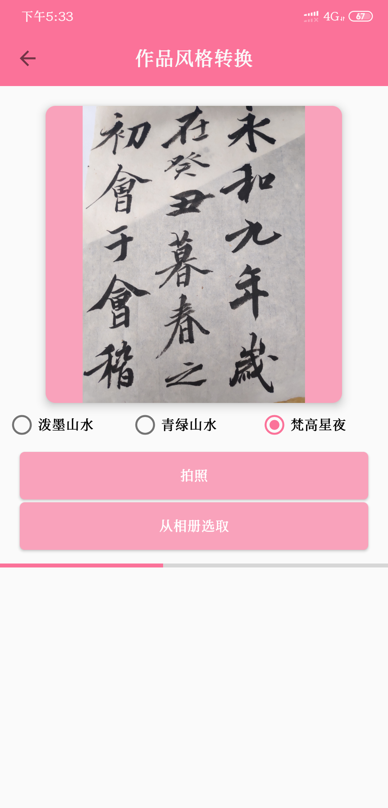
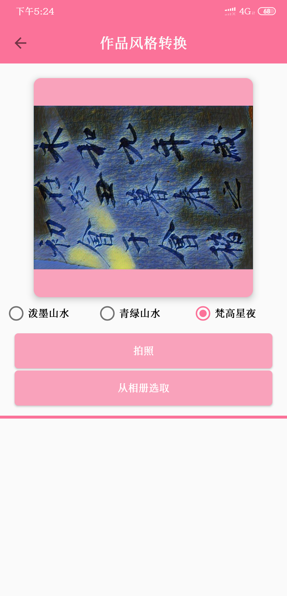
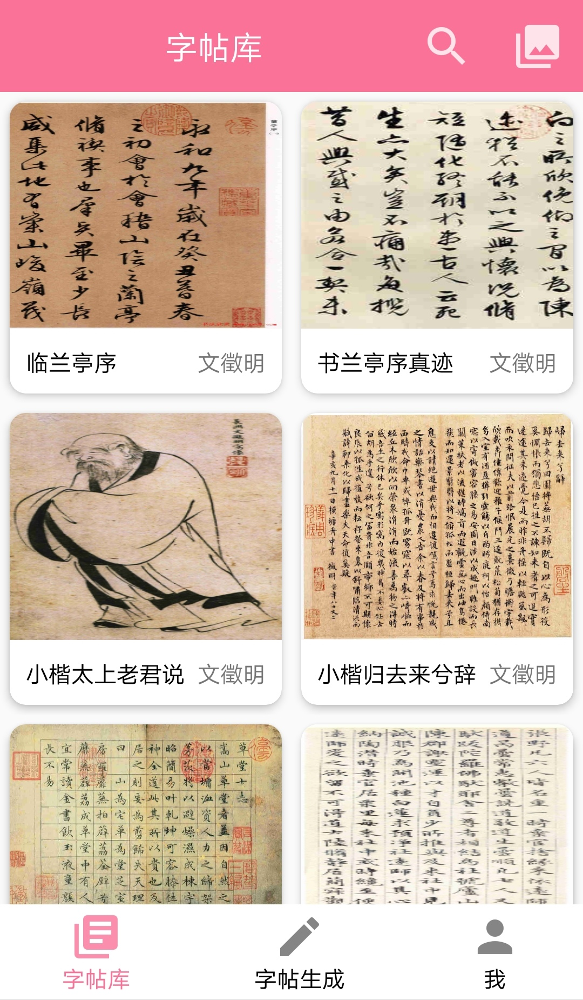

# AI书画大师 
 
An application, combine with Children side port and Parents side port, which let children take good care of their parents and parents can use smart phone to detect their heart rate.

## TODO          

* [ ] 碑帖降噪      

    对于污染严重的碑帖，通过对噪声建模，然后实现碑帖降噪的效果     

* [ ] 碑帖复原        

    对于残缺严重的碑帖，达到字体笔画、结构补全的功能     

* [x] 字帖生成   

    提取各大书法大师的字体特征，将用户输入的内容对应生成某位大师书法风格的碑帖，如输入“春眠不觉晓”，生成对应书法家书法风格的“春眠不觉晓”   

    

    
    
   

    上图为[颜真卿](https://zh.wikipedia.org/wiki/%E9%A2%9C%E7%9C%9F%E5%8D%BF)风格的生成结果

* [x] 字体辨识    

    用户临摹字体后，使用手机摄像头进行拍照，软件可以马上对用户练习的字体进行图像处理，并且调用字体风格分类CNN网络进行推理，给出最相似的书法家名称，并且计算相似程度    
    
    

    
    
   

* [ ] 笔体分析与教学    

    当用户对自己练习的作品进行拍照后，软件首先会生成标准字体，并与当前字体进行特征对比，分析当前字的结构和风格，指出用户字体在结构和笔画上的不足之处，并提出对应的修改条件    

    

    
    
   

    上图为模拟效果   

* [x] 指法练习   

    在移动设备上模拟毛笔字的书写效果，并增加字体结构分解功能，方便用户在字体的描摹之后进行字体架构的调整，加深对字体笔画结构的理解     

* [x] 书法作品风格转换    

    当用户完成一副书法作品后，可以对作品进行拍照上传，软件会在服务器端对该作品进行图像风格迁移，比如将一幅中国山水画自然的合成入作品中，提高作品整体的美感        

    

    
      
    
      

    上图为梵高星夜迁移效果   

    下图为国画迁移效果   
    

      
    
   

* [ ] 书友圈     

    用户登录之后可以把自己的作品分享到书友圈，可以在书友圈和其他书法爱好者交流评论、点赞分享，关注自己喜欢的书法爱好者的动态      

    

      
    
   

* [x] 字帖库    

    在字帖库中我们根据用户浏览记录为用户推荐相关书法家的作品，也可以根据自己的需要搜索其他作品，我们还提供了收藏碑帖的功能，用户可以在“我-收藏”中查看收藏的碑帖       

    

      
    
   

## 相关开源   

* [x] [App Server](https://github.com/McFlyWYF/AICopyBook)    

* [ ] 字体生成网络(todo)       

* [x] [字体分类网络](https://github.com/shentibeitaokongle/Calligraphy-Style-Classification)    

* [ ] 风格迁移网络(todo)    

# [License](./LICENSE)

    Copyright 2019 BarackBao   

    Licensed under the Apache License, Version 2.0 (the "License");
    you may not use this file except in compliance with the License.
    You may obtain a copy of the License at

        http://www.apache.org/licenses/LICENSE-2.0

    Unless required by applicable law or agreed to in writing, software
    distributed under the License is distributed on an "AS IS" BASIS,
    WITHOUT WARRANTIES OR CONDITIONS OF ANY KIND, either express or implied.
    See the License for the specific language governing permissions and
    limitations under the License.

